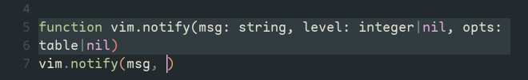

# quill

## :sparkles: features

opens signature inside function calls:



## :lock: requirements

- Neovim `>= 0.10.0`
- a lsp configured with `textDocument/signatureHelp` support

## :package: installation

Quill can be installed by adding *this* to your `lua/plugins/init.lua`:

```lua
{
    'comfysage/quill.nvim',
    after = function()
        require 'quill'.setup()
    end,
}
```

## :gear: configuration

Below is the default configuration.

```lua
{
  enable = true,
  signature = {
    active_parameter_hl = {
      link = "LspSignatureActiveParameter"
    },
    window = {
      height = 20,
      width = 64,
    },
  },
}
```
